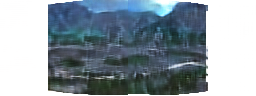

To view training results and loss plots run `python -m visdom.server` and go to http://localhost:8097.

To train a model:

```
bash python train.py --dataroot /data/panorama/ --model pix2pix --name panorama --dataset_mode custom --netG resnet_9blocks --input_nc 6 --output_nc 6 --display_ncols 0 --batch_size 8 --gan_mode wgangp --lambda_L1 150 --lambda_SSIM 200 --lr_policy plateau --gpu_ids 0
 ```

To see more intermediate results, check out `./checkpoints/facades_pix2pix/web/index.html`

## Some training results

| Epoch | input | ground-truth | output |
|-------|-------|--------------|--------|
| 01 |  |  |  |
| 50 |  |  |  |
| 100 |  |  |  |
| 150 |  |  |  |

To see the last training curves copy the files from the **visdom/** folder to **~/.visdom/**. Then run `visdom -en_path ~/.visdom/`.
